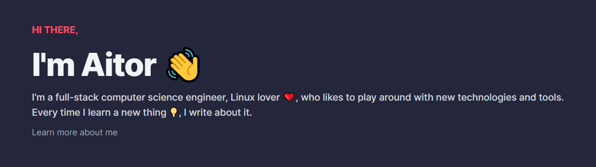

- 👨🏻‍💻 I'm a experienced developer about TypeScript and clean code
- ✍🏻 I write and post articles on my [website](https://aalonso.dev) and [DEV.to](https://dev.to/tairosonloa)
- 🎮 I enjoy playing videogames too!

Want to know more? [Check out my website](https://aalonso.dev).

## 🧰 My stack
<table>
  <tr>
    <th>Code</th>
    <th>Backend</th>
    <th>Frontend</th>
    <th>Infra</th>
  </tr>
  <tr>
    <td></td>
    <td></td>
    <td></td>
    <td></td>
  </tr>
  <tr>
    <td></td>
    <td></td>
    <td></td>
    <td></td>
  </tr>
  <tr>
    <td></td>
    <td></td>
    <td></td>
    <td></td>
  </tr>
  <tr>
    <td></td>
    <td></td>
    <td></td>
    <td></td>
  </tr>
</table>

## 📈 GitHub Stats

